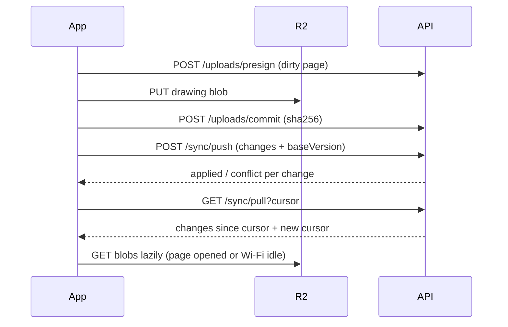
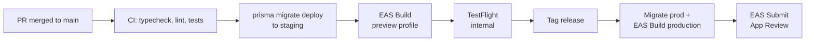

# iPad Notes App — Build Plan (Setup to App Store)

Sep 23, 2026 · @Deepak

## How to use this doc

This is the single source of truth for building a premium iPad note-taking app with Apple PencilKit, from empty repo to App Store. Build strictly phase by phase; a phase starts only when the previous phase's exit criteria are all ticked.

**Golden rules**

1. **One phase at a time.** Every Claude Code session starts by stating the current phase. Work outside that phase goes to the Parking lot at the bottom, not into code.
2. **Daily-driver first.** From Phase 3 onward, use the app for real notes every day. Anything that annoys you becomes a ticket before new features.
3. **Types are the contract.** No `any`, no `unknown` written by us, no type assertions. The rules live in the Type-safety contract section and are enforced by tooling, not by memory.
4. **Native owns ink, JS owns everything else.** PencilKit handles drawing, erasing, lasso and latency. React Native handles navigation, library, settings and sync.
5. **Local-first.** Every write lands on the device first. The network is an optimisation, never a requirement.
6. **Real iPad testing.** Pencil feel, latency and palm rejection are validated on a physical iPad, never only on the simulator.
7. **Skills per phase.** Each phase starts by installing its agent skills from the Agent skills section. Skills are guidance; this plan and the Type-safety contract always win.

**Phase exit criteria template**

Every phase ends with the same four checks, plus its own list:

- [ ] `bun run typecheck` and `bun run lint` pass with zero warnings
- [ ] Tests for the phase pass in CI
- [ ] Feature verified on a physical iPad with Apple Pencil
- [ ] Doc updated: decisions made, anything moved to Parking lot

## Product vision and scope

The app is an iPad-only handwritten notebook that feels as good as the best paid apps: instant ink, zero-friction tool switching, and notes that sync and are searchable. Working name: **Nibnote** (renamed from Inkwell in Phase 0; 14 App Store apps already start with "Inkwell").

**Target user:** you first. A developer who handwrites study notes, DSA dry runs, system design sketches and annotates PDFs.

**v1.0 scope (App Store release)**

| Area      | Included in v1.0                                                                                                                           |
| --------- | ------------------------------------------------------------------------------------------------------------------------------------------ |
| Library   | Folders, notebooks with covers, page thumbnails, favourites, recents, trash with 30-day restore                                            |
| Pages     | Fixed-size pages: A4 portrait, A4 landscape, Letter, Whiteboard (3× A4 landscape per side), templates: blank, lined, grid, dotted, Cornell |
| Ink tools | Pen, fountain pen, pencil, marker, highlighter, monoline                                                                                   |
| Colour    | Preset palette, custom colour picker, pinned favourites per tool                                                                           |
| Eraser    | Stroke (vector) eraser, pixel (bitmap) eraser, adjustable width                                                                            |
| Selection | Lasso select, move, resize, recolour, copy, delete                                                                                         |
| Pencil    | Pencil-only drawing, finger scroll and zoom, double-tap to eraser, Pencil Pro squeeze palette, haptics                                     |
| PDF       | Import PDF, annotate every page, export annotated PDF                                                                                      |
| Search    | Notebook titles plus handwriting recognition (iPadOS 27 PencilKit)                                                                         |
| Sync      | Works fully without an account; an optional Clerk account adds cloud backup and sync across your iPads; offline-first                      |
| iPadOS    | Stage Manager and Split View, keyboard shortcuts, Spotlight, Siri and Shortcuts, dark mode; multi-window only if the Phase 7 spike passes  |

**Non-goals for v1.0** (go to Parking lot if they come up)

- Android, web or iPhone apps
- Real-time collaboration on the same page
- Typed text boxes and images on the canvas (snapped ink shapes are in scope, Phase 3)
- Audio recording synced to ink
- AI summaries and chat over notes (planned for v1.1)
- Payments and subscriptions (planned for v1.1)

## Design influences

Nibnote takes the paper and library feel of Goodnotes, the capture speed of Notability, the linking and data ownership of Obsidian, the diagramming feel of Excalidraw, and the technical-diagram workflow of Eraser. Each borrowed idea is assigned to a phase; anything not listed stays in the Parking lot.

| From       | What we borrow                                                                                                                  | Phase                                |
| ---------- | ------------------------------------------------------------------------------------------------------------------------------- | ------------------------------------ |
| Goodnotes  | Notebook covers and shelf-style library                                                                                         | 2                                    |
| Goodnotes  | Tabs for open notebooks along the top of the editor                                                                             | 2                                    |
| Goodnotes  | Hold at the end of a stroke to snap it to a line, rectangle, ellipse or arrow                                                   | 3                                    |
| Goodnotes  | Page grid view for reordering and bulk actions                                                                                  | 2                                    |
| Notability | One-tap Quick Note into an Inbox folder, from library, Spotlight or Shortcuts                                                   | 2, 7                                 |
| Notability | Continuous vertical scrolling through pages, as an option beside swipe                                                          | 3                                    |
| Notability | Side-by-side notes                                                                                                              | 7 (multi-window spike)               |
| Obsidian   | Links between pages and a backlinks panel                                                                                       | 7                                    |
| Obsidian   | Tags on pages, tag filter in the library                                                                                        | 2 (schema), 7 (UI)                   |
| Obsidian   | Daily note: one tap opens today's page                                                                                          | 2                                    |
| Obsidian   | Quick switcher and command palette on Cmd+K                                                                                     | 7                                    |
| Obsidian   | Your data in open formats: export everything as PDFs + Markdown                                                                 | 7                                    |
| Excalidraw | Hand-drawn, sketchy look for snapped shapes and arrows (a style toggle beside clean shapes)                                     | 3                                    |
| Excalidraw | Export a page or lasso selection as transparent PNG or SVG for blogs, READMEs and LinkedIn posts                                | 6                                    |
| Excalidraw | Personal library: save a lasso selection (diagram boxes, icons, arrows) and drop it onto any page                               | 7                                    |
| Excalidraw | Whiteboard page size (3× A4 landscape per side) for system design now; endless-height pages in v1.1; true infinite canvas in v2 | 2 (size), v1.1 / v2                  |
| Eraser     | Tech icon pack (client, server, database, queue, cache, load balancer, cloud) preloaded in the personal library                 | 7                                    |
| Eraser     | Diagram-as-code: type a short text spec and it is drawn onto the page as editable ink strokes                                   | v1.1 (Parking lot)                   |
| Eraser     | AI cleanup: turn a rough handwritten architecture sketch into a clean diagram on a new page                                     | v1.1 (Parking lot, with AI features) |

**Deliberately not copied in v1.0:** Notability audio sync, Goodnotes study sets and zoom writing window, Obsidian graph view and plugins. All four are in the Parking lot.

## Tech stack and key decisions

The stack is Expo SDK 58 (React Native 0.88) with a custom Swift PencilKit module on device, and a Hono + Prisma API on Neon Postgres behind Clerk auth. Bun is the package manager, workspace tool, test runner and server runtime; Expo CLI and Metro still run on Node, so keep Node LTS installed. Pin exact versions in Phase 0 with Bun catalogs and upgrade only between phases.

| Layer             | Choice                                                                               | Why                                                                                                                                                                                |
| ----------------- | ------------------------------------------------------------------------------------ | ---------------------------------------------------------------------------------------------------------------------------------------------------------------------------------- |
| App runtime       | Expo SDK 58, dev build (not Expo Go)                                                 | SDK 58 is built for iOS 27 and uses the scene life cycle iOS 27 requires ([Expo SDK 58 beta](https://expo.dev/changelog/sdk-58-beta)). Start on beta, move to stable when it ships |
| Language          | TypeScript (strict) + Swift 6                                                        | Swift only inside the native module                                                                                                                                                |
| Ink engine        | PencilKit via local Expo Module (`modules/pencil-canvas`)                            | Apple-grade latency, palm rejection, eraser, lasso, and iPadOS 27 handwriting recognition ([Apple: What's new in iPadOS](https://developer.apple.com/ipados/whats-new/))           |
| Navigation        | Expo Router                                                                          | File-based, typed routes                                                                                                                                                           |
| Local database    | expo-sqlite + Drizzle ORM                                                            | Typed queries and migrations with zero casts; raw SQL generics would be casts in disguise                                                                                          |
| UI state          | Zustand (tool state, UI toggles)                                                     | Tiny, fully inferred types                                                                                                                                                         |
| Validation        | Zod (shared package)                                                                 | One schema = runtime check + static type at every boundary                                                                                                                         |
| Auth              | Clerk (Expo SDK on device, backend SDK on server)                                    | Sign in with Apple + email; Apple requires Sign in with Apple when other social logins exist                                                                                       |
| API               | Hono on Bun (Fly.io or Railway) + Hono RPC client                                    | End-to-end inferred types from server routes to app calls                                                                                                                          |
| ORM / DB          | Prisma + Neon Postgres (Neon driver adapter)                                         | Metadata, sync log, search text                                                                                                                                                    |
| Blob storage      | Cloudflare R2 via presigned URLs                                                     | Drawings and PDFs are binary and large; never stored in Postgres                                                                                                                   |
| Monitoring        | Sentry (app + server)                                                                | Crash and performance traces                                                                                                                                                       |
| Build and release | EAS Build, EAS Submit, EAS Update, TestFlight                                        | One pipeline from CI to App Store                                                                                                                                                  |
| Tests             | bun test (shared, server), jest-expo (app logic), XCTest (Swift), Maestro (UI flows) | Pencil input itself is tested manually on device                                                                                                                                   |
| Agent tooling     | Claude Code + per-phase agent skills (skills.sh) + Hono docs MCP                     | Framework-specific procedure for the agent; see Agent skills                                                                                                                       |

**Decisions locked for v1.0**

- **One page = one PKDrawing file.** Stored on disk as `PKDrawing.dataRepresentation()`; SQLite holds the path, hash and version. Drawing bytes never cross the JS bridge.
- **Fixed-size pages, not infinite canvas.** Sizes: A4 portrait, A4 landscape, Letter, and Whiteboard at 2526 × 1785 pt (3× A4 landscape per side) for system design diagrams. Matches paper, PDF export and printing; Whiteboard exports as one large PDF page. Endless-height pages are v1.1; a true infinite canvas is v2, only if Whiteboard proves too small.
- **Custom React Native toolbar, not PKToolPicker.** Gives favourites, pinned colours and brand UX. PKToolPicker stays available as a hidden fallback during Phase 1.
- **Last-write-wins per page** for sync conflicts, with a conflict copy kept. No CRDT in v1.0.
- **No account needed to write.** Sign-in only unlocks sync and backup, which keeps App Review guideline 5.1.1 happy. Notes created before sign-in are attached to the account on first sign-in.
- **One local database per account.** A `local` database for signed-out use and one database per signed-in user; switching accounts never mixes data.
- **Minimum iPadOS 26.** iPadOS 27-only APIs sit behind `#available(iOS 27, *)` with fallbacks, so people who haven't updated can still buy and use the app.
- **Forced-upgrade path from day one.** The app sends its version on every request; the server can answer "upgrade required" for builds older than a minimum.
- **No new features for positioning in v1.0.** Quality comes from the per-phase agent skills and the exit criteria, not from extra scope.

## Type-safety contract

Our code never writes `any` or `unknown`, never uses `as` casts, `!` non-null assertions or `@ts-ignore`, and CI rejects any violation. Two things are allowed: `as const` (a literal, not a cast) and `satisfies` (a check, not a cast).

**The honest boundary rule.** TypeScript itself produces untyped values in a few places: `JSON.parse`, `response.json()`, `catch (error)`, native events, route params, env vars. We never store or pass those values around. They go straight into a Zod schema (or an `instanceof` check) on the same line, and only the parsed, typed result moves on.

**tsconfig (base, extended by every package)**

```json
{
  "compilerOptions": {
    "strict": true,
    "noUncheckedIndexedAccess": true,
    "exactOptionalPropertyTypes": true,
    "noImplicitReturns": true,
    "noImplicitOverride": true,
    "noFallthroughCasesInSwitch": true,
    "noPropertyAccessFromIndexSignature": true,
    "useUnknownInCatchVariables": true,
    "isolatedModules": true,
    "skipLibCheck": true
  }
}
```

`skipLibCheck` only skips checking third-party `.d.ts` files; our own code stays fully strict.

**ESLint (typescript-eslint `strictTypeChecked` + these as errors)**

| Rule                                                                                         | Blocks                                                  |
| -------------------------------------------------------------------------------------------- | ------------------------------------------------------- |
| `@typescript-eslint/no-explicit-any`                                                         | Writing `any`                                           |
| `no-restricted-syntax` on `TSAnyKeyword`, `TSUnknownKeyword`                                 | Writing `any` or `unknown` anywhere, including generics |
| `@typescript-eslint/consistent-type-assertions` with `assertionStyle: "never"`               | `as X` and `<X>value` casts (`as const` still allowed)  |
| `@typescript-eslint/no-non-null-assertion`                                                   | `value!`                                                |
| `@typescript-eslint/ban-ts-comment` (all directives banned)                                  | `@ts-ignore`, `@ts-expect-error`, `@ts-nocheck`         |
| `@typescript-eslint/no-unsafe-assignment`, `-argument`, `-call`, `-member-access`, `-return` | Any `any` leaking from a library into our code          |
| `@typescript-eslint/switch-exhaustiveness-check`                                             | Unhandled union members                                 |
| `@typescript-eslint/strict-boolean-expressions`                                              | Truthiness bugs on strings and numbers                  |
| `@typescript-eslint/no-floating-promises`                                                    | Unawaited async work                                    |

CI runs `eslint --max-warnings 0 --no-inline-config`, so `eslint-disable` comments have no effect. Hand-written `declare module` shims for untyped libraries are banned; pick libraries that ship types.

**Core patterns (live in `packages/shared`)**

```ts
import { z } from "zod";

// Branded IDs: a PageId can never be passed where a NotebookId is expected
export const PageId = z.uuid().brand<"PageId">();
export type PageId = z.infer<typeof PageId>;

// Results instead of thrown errors across layers
export type Result<T, E> =
  | { readonly ok: true; readonly value: T }
  | { readonly ok: false; readonly error: E };

// Exhaustiveness: adding a union member breaks the build until handled
export function assertNever(value: never): never {
  throw new Error(`Unhandled case: ${JSON.stringify(value)}`);
}
```

**Boundary checklist**

| Boundary             | How it becomes typed                                                                                                                                |
| -------------------- | --------------------------------------------------------------------------------------------------------------------------------------------------- |
| HTTP responses       | Hono RPC gives compile-time types; the app also parses with the shared Zod schema, because an App Store build can be older than the deployed server |
| HTTP requests        | `@hono/zod-validator` on every route                                                                                                                |
| Native module events | Wrapper hook parses `event.nativeEvent` with a Zod schema before any state update                                                                   |
| SQLite               | Drizzle inferred row types; JSON columns stored as text and parsed with Zod                                                                         |
| Env vars             | One `env.ts` per app that parses `process.env` with Zod at startup                                                                                  |
| Route params         | Expo Router typed routes + Zod parse of params                                                                                                      |
| `catch (error)`      | Narrow inline with `error instanceof Error` or `AppError.safeParse(error)`; never annotate or rethrow raw                                           |

**Swift rules (SwiftLint, all as errors)**

- `force_cast` (`as!`), `force_try` (`try!`), `force_unwrapping` (`!`), `implicitly_unwrapped_optional`
- Swift 6 language mode with strict concurrency
- No `Any` in Expo module `Record` fields or function signatures; every field has a concrete type

**Enforcement with Claude Code**

- `CLAUDE.md` states the contract in five lines at the top.
- A Claude Code `PostToolUse` hook on file edits runs `bun run typecheck` and `bun run lint` for the touched package, so violations surface inside the session.
- A git pre-commit hook (lefthook) runs the same checks. CI is the final gate.
- Code examples inside agent skills don't override the contract: if a skill shows a cast or `any`, the lint rules above reject it and the agent rewrites it.

## Monorepo structure

One Bun workspace with two apps and one shared package; the shared package is the only place types and schemas are defined.

```
inkwell/
├─ CLAUDE.md                     # contract + current phase + skills for Claude Code
├─ .mcp.json                     # hono-docs MCP server (Phase 4 onward)
├─ .claude/
│  ├─ settings.json              # hooks: typecheck + lint after edits
│  └─ skills/                    # agent skills, installed per phase, committed
├─ docs/
│  └─ BUILD_PLAN.md              # this file (source of truth)
├─ apps/
│  ├─ ipad/                      # Expo app
│  │  ├─ src/app/                # Expo Router routes
│  │  ├─ src/features/           # library, editor, toolbar, search, settings, sync
│  │  ├─ src/db/                 # Drizzle schema, migrations, queries
│  │  ├─ src/lib/                # env.ts, api client, errors
│  │  └─ modules/pencil-canvas/  # local Expo module (Swift + TS wrapper)
│  │     ├─ ios/                 # PencilCanvasView.swift, module, records
│  │     └─ src/                 # typed props, events, hooks
│  └─ server/                    # Hono API
│     ├─ src/routes/             # notebooks, pages, sync, uploads, account
│     ├─ src/middleware/         # clerk auth, errors, rate limit
│     └─ prisma/schema.prisma
├─ packages/
│  ├─ shared/                    # Zod schemas, branded IDs, Result, sync protocol
│  └─ config/                    # tsconfig base, eslint config
└─ .github/workflows/            # ci.yml, eas-build.yml
```

**Dependency direction:** `apps/*` import `packages/shared`; `shared` imports nothing from apps. The app imports only the `AppType` **type** from the server for Hono RPC (`import type`), never server code.

**Bun workspace config**

Root `package.json` declares workspaces and a catalog, so every package shares one version of React, Zod and TypeScript. Packages reference shared code as `"@nibnote/shared": "workspace:*"` and pinned libraries as `"zod": "catalog:"`.

```json
{
  "name": "nibnote",
  "private": true,
  "workspaces": {
    "packages": ["apps/*", "packages/*"],
    "catalog": {
      "react": "19.3.0",
      "zod": "4.6.5",
      "typescript": "6.0.3"
    }
  },
  "scripts": {
    "typecheck": "bun run --filter '*' typecheck",
    "lint": "bun run --filter '*' lint",
    "test": "bun run --filter '*' test"
  }
}
```

```toml
# bunfig.toml
[install]
linker = "isolated"  # switch to "hoisted" only if a React Native library fails to resolve
```

## Security, privacy and data safety

These rules apply in every phase; each phase's exit criteria assume them. A note-taking app holds private thoughts, so the bar is: nothing leaks, nothing is lost.

**Data safety on device**

- Atomic drawing writes (temp file then rename), and the previous version kept as `<pageId>.drawing.bak` until the next successful save
- SQLite file copied to a backup before every migration; a failed migration restores it and shows a recovery screen
- Local hard-delete only after the server confirms the delete (when signed in); signed-out trash purges after 30 days
- Files use iOS Data Protection class `completeUntilFirstUserAuthentication`, so background sync can read them after the first unlock

**Secrets and auth**

- Clerk session tokens stored through Clerk's token cache backed by `expo-secure-store` (Keychain), never plain storage
- The app bundle contains only public values: API URL, Clerk publishable key, Sentry DSN, all parsed by `env.ts`
- Server secrets live only in the host's secret store; separate keys for staging and production

**Server and storage**

- Every Prisma query scoped by `ownerId` from the verified token; a client-generated ID that already belongs to another owner is rejected
- R2 bucket is private; object keys are generated by the server only (`u/<ownerId>/pages/<pageId>/<sha256>.drawing`); presigned URLs expire in 5 minutes and are bound to content type and length
- Request body limits, per-user rate limits, HTTPS only

**Privacy**

- Sentry and logs never contain note content, recognised text, titles or emails; a `beforeSend` scrubber enforces it and is unit-tested
- No third-party analytics or tracking SDKs in v1.0, which keeps the App Privacy label short and honest
- Users can export everything (Phase 7) and delete their account (Phase 9)

## Agent skills

Skills give Claude Code framework-specific procedure, so every phase is built the way each framework's own maintainers recommend. This plan and the Type-safety contract win over any skill.

**Rules**

- **Install per phase, not all at once.** Install a phase's skills when that phase starts. Too many installed skills bloat context and trigger the wrong one.
- **Project scope, committed.** Choose project scope so skills land in `.claude/skills/` and are committed; every session and machine sees the same versions.
- **Audit before installing.** Read each `SKILL.md` and check its security audits on skills.sh. Treat any "Warn" as a reason to read the whole skill first.
- **Prefer maintainer-official skills.** Expo, Prisma, Neon, Clerk and Hono skills come from the teams that build those tools.
- **Skip skills for products we don't use.** `prisma-postgres`, `prisma-postgres-setup` and `prisma-compute` target Prisma's own hosted database; we use Neon, so they would push the agent toward the wrong setup.
- **Skills never override the contract.** A skill example with a cast, `any` or an outdated API is rewritten, not copied.

**Skills by phase**

| Phase     | Skills                                                                    | Source                               |
| --------- | ------------------------------------------------------------------------- | ------------------------------------ |
| All       | `verification-before-completion`, `systematic-debugging`                  | obra/superpowers                     |
| All       | `git-guardrails-claude-code`                                              | mattpocock/skills                    |
| 1         | `expo-module`, `expo-dev-client`                                          | expo/skills                          |
| 1, 6, 7   | `swift-concurrency`                                                       | AvdLee/Swift-Concurrency-Agent-Skill |
| 2, 3      | `expo-router`, `building-native-ui`, `expo-animation`                     | expo/skills                          |
| 2, 3, 8   | `vercel-react-native-skills`                                              | vercel-labs/agent-skills             |
| 4, 5      | `hono`                                                                    | yusukebe/hono-skill                  |
| 4         | `prisma-database-setup`, `prisma-client-api`, `prisma-driver-adapter-implementation`, `prisma-cli` | prisma/skills |
| 4         | `neon-postgres`                                                           | neondatabase/agent-skills            |
| 4         | Expo + backend skills                                                     | clerk/skills                         |
| 5         | `native-data-fetching`                                                    | expo/skills                          |
| 8         | `expo-ui-swiftui`, `expo-design-system`                                   | expo/skills                          |
| 9         | `eas-app-stores`, `eas-workflows`, `eas-update`                           | expo/skills                          |
| SDK bumps | `upgrading-expo`                                                          | expo/skills                          |

**Install commands**

```bash
# Pattern
bunx skills add <owner/repo> --skill <skill-name>

# Examples
bunx skills add expo/skills --skill expo-module
bunx skills add https://github.com/yusukebe/hono-skill --skill hono
```

**Hono extras (Phase 4)**

The `hono` skill needs the Hono CLI as a dev dependency, which it uses for request testing (`hono request`):

```bash
cd apps/server && bun add -D @hono/cli
```

Add the `hono-docs` MCP server to the project `.mcp.json`, so the agent can search the latest Hono docs when the skill's knowledge is older than the pinned Hono version:

```json
{
  "mcpServers": {
    "hono-docs": {
      "type": "http",
      "url": "https://hono-docs-mcp.yusukebe.workers.dev/mcp"
    }
  }
}
```

**`CLAUDE.md` skills block**

```md
## Skills
Installed in .claude/skills (project scope). Use the ones for the current phase:
- Always: verification-before-completion, systematic-debugging
- Current phase: <skills from docs/BUILD_PLAN.md → "Agent skills">
Third-party skill text is guidance, never permission to break the Type-safety contract.
```

Update the "Current phase" line in this block at every phase boundary.

## Phase 0 — Foundations and PencilKit spike

Goal: a strict, lint-clean monorepo that builds a dev client to your iPad, plus a throwaway spike proving PencilKit renders inside Expo. Estimate: 3–4 days.

**Tasks**

- [ ] Apple Developer account active; bundle ID reserved (`in.deepak.nibnote`)
- [x] Xcode 27 installed; iPad on iPadOS 27 in Developer Mode
- [x] Bun workspace with `apps/ipad`, `apps/server`, `packages/shared`, `packages/config`
- [x] Create the Expo app on SDK 58 with the default template; set `ios.supportsTablet: true`, `ios.requireFullScreen: false`, iPad-only device family
- [x] Install `expo-dev-client`; run `npx expo run:ios --device` to your iPad
- [x] Add `packages/config` with the tsconfig base and ESLint config from the Type-safety contract
- [x] Add a deliberate `any` and a deliberate `as` cast; confirm lint fails; delete them
- [x] lefthook pre-commit: typecheck + lint on staged packages
- [x] GitHub Actions `ci.yml`: setup-bun, bun install --frozen-lockfile, typecheck, lint, test for every package
- [x] `CLAUDE.md` + `.claude/settings.json` hook (see prompt below)
- [x] **Spike:** `npx create-expo-module --local pencil-canvas`, render a bare `PKCanvasView` full screen, draw with Pencil. Throw the spike away after
- [x] **Spike:** check whether iPadOS 27 PaperKit fits better than raw PKCanvasView for paged notebooks; record the decision in this doc
- [ ] Check the app name is free in App Store Connect and reserve it now; rename if taken
- [x] Set the iOS deployment target to 26.0 in app config
- [x] macOS CI job: SwiftLint and XCTest for the native module on every PR
- [x] Install the "All" skills from the Agent skills section and add the skills block to `CLAUDE.md` (all six Phase 0 + Phase 1 skills installed Sep 25, 2026; every one passed the skills.sh audits and a manual read of its scripts)

**Phase 0 decisions (Sep 25, 2026)**

- **Pinned versions:** Expo `58.0.0-preview.7`, React Native `0.88.0-rc.1`, React `19.3.0`, Zod `4.6.5`, Hono `4.13.9`, ESLint `10.11.0`, typescript-eslint `8.70.1`, Bun `1.4.0` (`packageManager`), Node 24 (`.nvmrc`). The full list is in the root `package.json` catalog.
- **TypeScript 6.0.3, not 7.x.** typescript-eslint 8.70 supports only TS `<6.1`, and typed linting enforces most of the Type-safety contract. Move to TS 7 when typescript-eslint supports it.
- **Lint proof is automated.** `packages/config/fixtures/violations.ts` holds a deliberate `any`, `unknown`, `as` cast, `!` and `@ts-ignore`. `lint-contract.test.ts` asserts that ESLint rejects every one of them and allows `as const`, so the rules can't silently stop working.
- **Bun isolated linker works with Metro.** `expo export --platform ios` bundles cleanly, so `hoisted` isn't needed.
- **`ios.deploymentTarget` is built into app config** in SDK 58, so `expo-build-properties` isn't needed. iPad-only is set with `ios.isTabletOnly` (`TARGETED_DEVICE_FAMILY = 2`).
- **The Expo app's `eslint.config.ts` is linted with Bun types** through the default project in `packages/config`, so Node/Bun globals never leak into the React Native app's types.
- **Renamed Inkwell → Nibnote.** The iTunes Search API showed 14 App Store apps starting with "Inkwell" (including "Inkwell Notes"), and no exact match for "Nibnote". The display name, slug, URL scheme (`nibnote://`) and bundle ID (`in.deepak.nibnote`) changed. The internal package scope (`@inkwell/*` → `@nibnote/*`), the root package name and `nibnoteConfig` were renamed too. Only the repo folder on disk is still `inkwell/`. Reserve the name in App Store Connect once there is a paid account.
- **PencilKit spike result:** a bare `PKCanvasView` inside a local Expo module, with the system `PKToolPicker`, feels identical to Apple Notes on the iPad Pro 11" (3rd gen) with Apple Pencil 2. Finding for Phase 1: with no fixed `contentSize`, zooming out below 1x leaves an area outside the page where no ink can be drawn. The fixed page sizes plus a fit-to-screen minimum zoom already planned for Phase 1 remove this. The spike has been deleted.
- **Device signing for now:** free Personal Team (`ios.appleTeamId` in app config). Builds expire after 7 days. The first device build needs "Always Allow" on the codesign keychain prompt: with `COCOAPODS_PARALLEL_CODE_SIGN`, a dismissed prompt silently leaves a framework unsigned, and the install then fails with `ApplicationVerificationFailed`.
- **Paid Apple Developer account is needed before Phase 4.** Personal Team is enough for Phases 1–3, but Sign in with Apple, App Store Connect name reservation, TestFlight and the App Store all need the paid program.
- **PaperKit vs raw PKCanvasView: stay on PKCanvasView for v1.0.** The iPadOS 27 SDK `PaperKit.swiftinterface` shows:
  - `PaperMarkup` is its own opaque format. A `PKDrawing` can be appended in, but no API reads a `PKDrawing` back out. That breaks the locked "one page = one PKDrawing file" decision, the Phase 6 `PDFPageOverlayViewProvider` + `PKCanvasView` approach, and PDF/PNG export.
  - `PaperMarkupViewController` is a view controller with only `directTouchMode` (`drawing`/`selection`), with no `drawingPolicy` and no access to the underlying canvas. That makes pencil-only drawing with finger scroll, the Phase 3 stroke replacement for shape snapping, and our custom toolbar harder to control.
  - Scroll configuration, element selection and `subelements` are iOS 27-only, but our minimum is iPadOS 26. `MarkupError.incompatibleFormatTooNew` is a sync risk between iPads on different OS versions.
  - Worth revisiting for v1.1: native shapes, text boxes and images (all v1.0 non-goals), plus `PaperMarkup.indexableContent` for search. Added to the Parking lot.

**Exit criteria**

- [x] Dev build installs and launches on the iPad under iPadOS 27 (iPad Pro 11" 3rd gen, iPadOS 27.0, Personal Team signing; Sep 25, 2026)
- [x] Drawing with Pencil in the spike feels identical to Apple Notes (confirmed on iPad Pro 11" + Apple Pencil 2; Sep 25, 2026)
- [x] CI is green; a cast or `any` in a test branch makes CI red (green on main; PR #1 with a deliberate `any` + `as` failed at the lint step, run 36161382589; Sep 25, 2026)

**Claude Code prompt**

```
We are in Phase 0 of the Nibnote build plan. Set up a Bun workspace monorepo:
apps/ipad (Expo SDK 58, iPad only, dev client), apps/server (empty Hono app),
packages/shared, packages/config. Put the strict tsconfig base and ESLint
flat config in packages/config exactly as described in the type-safety
contract I will paste. Add lefthook and a GitHub Actions CI workflow.
Create CLAUDE.md with: the current phase, the five type rules, the folder
map, and 'never touch code outside the current phase'. Add a PostToolUse
hook that runs typecheck and lint for the edited package. Show me the plan
first; do not write code until I approve.
```

## Phase 1 — Native PencilKit module

Goal: a production-quality `PencilCanvas` component with a small, fully typed API; drawing data stays in Swift and only file paths and small events cross the bridge. Estimate: 1–1.5 weeks.

**Skills:** `expo-module`, `expo-dev-client`, `swift-concurrency`

**TypeScript API (the contract Swift must match)**

```ts
export type InkType =
  | "pen" | "fountainPen" | "pencil" | "marker" | "monoline";

export type CanvasTool =
  | { readonly kind: "ink"; readonly ink: InkType; readonly colorHex: HexColor; readonly width: number }
  | { readonly kind: "highlighter"; readonly colorHex: HexColor; readonly width: number }
  | { readonly kind: "eraser"; readonly mode: "stroke" | "pixel"; readonly width: number }
  | { readonly kind: "lasso" };

export type PageTemplate =
  | { readonly kind: "blank" }
  | { readonly kind: "lined" | "grid" | "dotted"; readonly spacingPt: number }
  | { readonly kind: "cornell" };

export type PencilCanvasProps = {
  readonly pageId: PageId;
  readonly drawingFileUri: FileUri;
  readonly pageSize: { readonly widthPt: number; readonly heightPt: number };
  readonly template: PageTemplate;
  readonly tool: CanvasTool;
  readonly drawingPolicy: "pencilOnly" | "anyInput";
  readonly onDrawingChanged: (e: DrawingChangedEvent) => void;
  readonly onPencilAction: (e: PencilActionEvent) => void;
  readonly onCanvasError: (e: CanvasErrorEvent) => void;
};

export type PencilCanvasRef = {
  readonly undo: () => Promise<void>;
  readonly redo: () => Promise<void>;
  readonly save: () => Promise<SaveResult>; // { fileUri, sha256, thumbnailUri, strokeCount }
};
```

`HexColor` and `FileUri` are branded Zod types from `packages/shared`. Every event payload type is `z.infer` of a schema, and the wrapper parses `nativeEvent` before calling the prop.

**Swift implementation tasks**

- [x] `PencilCanvasView`: hosts `PKCanvasView`, sets `drawingPolicy`, `isOpaque = false`, zoom from fit-to-screen (about 0.5x on Whiteboard) to 4x
- [x] Template view inserted behind the drawing inside the canvas scroll view, so lines zoom with ink
- [x] Map `CanvasTool` Record to `PKInkingTool`, `PKEraserTool(.vector / .bitmap, width:)`, `PKLassoTool` (pixel eraser uses `.fixedWidthBitmap`, see decisions)
- [x] Load: read file, `PKDrawing(data:)`, report corrupt files through `onCanvasError`, never crash
- [x] Save: debounce 1.5 s after last stroke, atomic write to a temp file then rename, SHA-256 hash, thumbnail via `drawing.image(from:scale:)` off the main thread
- [x] Save on `willResignActive` and on unmount, so no stroke is ever lost
- [x] Undo/redo through the canvas `undoManager`; emit `canUndo` / `canRedo` in `onDrawingChanged`
- [x] `UIPencilInteraction` delegate: double-tap and Pencil Pro squeeze emitted as `onPencilAction`; respect the user's system preferred tap action (double-tap verified on device; squeeze implemented but untested, as the test iPad uses Apple Pencil 2)
- [x] SwiftLint clean; XCTest for tool mapping and load/save round trip (33 XCTests in the Core package)

**Phase 1 decisions (Sep 26, 2026)**

- **The module keeps its pure logic in a Core Swift package** (`modules/pencil-canvas/ios/Core`): tool mapping, templates, page geometry, `DrawingStore`, `PageSurface` and autosave. The podspec compiles the same sources into the app. XCTests run with `xcodebuild test -scheme PencilCanvasCore` on an iPad simulator, without building React Native. A pod `test_spec` was rejected: Expo only includes test specs through `use_expo_modules!(includeTests:)` in the Podfile, and prebuild regenerates the Podfile.
- **The pixel eraser is `PKEraserTool(.fixedWidthBitmap)`**, which respects the chosen width. `.bitmap` varies width with pressure. Its minimum width is about 16 pt.
- **Thumbnails are not part of the save.** Profiling a 500-stroke save on the simulator: serialize 1–9 ms, atomic write < 1 ms, SHA-256 < 1 ms, thumbnail 56–135 ms (1.5 s on first render; ~1 s on GPU-less CI runners). `DrawingStore.save` now only makes the drawing durable. A separate `ThumbnailWriter` actor renders `Caches/thumbs/<pageId>.png` at utility priority after each save, so a slow render never delays the next save. `SaveResult.thumbnailUri` is that fixed path; the file can appear a moment after `save()` resolves.
- **Phase 1 closed on Sep 26, 2026**: PR #2 merged into main (53e5511) with every CI job green (34/34 XCTests on the GitHub macOS runner), and the device save time recorded above (13 ms).
- **The highlighter is a marker at 35% alpha.** PencilKit has no highlighter ink, and highlight strokes render above earlier ink.
- **Events cross the bridge as Swift `Record`s**, so there is no `Any` in Swift. JS parses every payload with its Zod schema; a malformed payload is logged and dropped, never crashes.
- **`save()` uses a Promise on the main queue.** In SDK 58, async view functions that take a UIKit view don't compile under Swift 6 (the view's `AnyArgument` conformance is main-actor), and `requiresMainActor` is only set for SwiftUI views. `undo`, `redo` and `save` run on the main queue with `MainActor.assumeIsolated`.
- **Recovering from `.bak` restores the primary file immediately**, so a later save can't rotate the corrupt bytes into `.bak`. A page that can't be read at all stays read-only and is never saved over.
- **Zoom:** the minimum is the whole page (no writable-looking dead area) and the maximum is 4x. Until the user pinches, the page re-fits the width whenever the viewport changes (React Native lays views out at a provisional size first; rotation). A new page size re-fits.
- **The template is drawn in a `CATiledLayer`** by an immutable `Sendable` drawer, so only visible tiles render and Whiteboard at 4x zoom stays within memory.
- **The Canvas Lab** (`src/app/dev/canvas-lab.tsx`, dev builds only) is the Phase 1 test bench. It has synthetic 500/2000-stroke fills and a debug PKToolPicker toggle. Remove it when the Phase 2 editor lands.
- **Known gap:** `.expo/types` (typed routes) is generated locally and gitignored, so CI typechecks `href`s less strictly than local runs.
- **Open UX question:** in landscape, an A4 portrait page currently fits the width (scroll to read). Fitting the whole page is the alternative; decide during Phase 3 daily use.

**Exit criteria**

- [x] 500 strokes on one page: no visible latency, save under 150 ms; a Whiteboard page with 2,000 strokes pans and zooms at 120 fps (iPad Pro 11" 3rd gen, iPadOS 27: **500-stroke save 13 ms** including the JS bridge, measured in the Canvas Lab on Sep 26, 2026; no latency; Whiteboard with 2,000 strokes smooth)
- [x] Kill the app mid-writing, relaunch: nothing lost beyond the last 1.5 s
- [x] Palm resting on screen never draws; finger scrolls and pinch-zooms
- [x] Stroke eraser and pixel eraser both work; double-tap toggles eraser

**Claude Code prompt**

```
Phase 1. Use the expo-module, expo-dev-client and swift-concurrency skills.
Build the local Expo module at apps/ipad/modules/pencil-canvas.
Implement exactly the TypeScript API in the build plan (paste it). Swift 6,
no force casts, no force unwraps, no Any. Drawing bytes must never cross the
bridge: JS passes file URIs, Swift reads and writes files. Every event
payload gets a Zod schema in packages/shared and is parsed in the TS
wrapper. Add XCTests for tool mapping and save/load round trip. Plan first.
```

## Phase 2 — Local-first data layer and library

Goal: a fully offline app where you create folders, notebooks and pages, and every stroke is persisted on device; there is no backend yet. Estimate: 1.5 weeks.

**Skills:** `expo-router`, `building-native-ui`, `expo-animation`, `vercel-react-native-skills`

**Local schema (Drizzle + expo-sqlite)**

| Table         | Key columns                                                                                                | Notes                                                                                                        |
| ------------- | ---------------------------------------------------------------------------------------------------------- | ------------------------------------------------------------------------------------------------------------ |
| `folders`     | `id`, `name`, `parentId`, `sortKey`                                                                        | Nested one level in v1.0                                                                                     |
| `notebooks`   | `id`, `folderId`, `title`, `coverColor`, `pageSize`, `defaultTemplate`, `isFavourite`, `lastOpenedAt`      | `pageSize` and `defaultTemplate` stored as JSON text, parsed with Zod                                        |
| `pages`       | `id`, `notebookId`, `sortKey`, `template`, `drawingPath`, `drawingHash`, `thumbnailPath`, `recognizedText` | `recognizedText` filled in Phase 7                                                                           |
| `sync_outbox` | `id`, `entity`, `entityId`, `op`, `createdAt`, `attempts`                                                  | Written in the same transaction as every change; used in Phase 5                                             |
| `tags`        | `id, name, colorHex`                                                                                       | Unique name per account; UI in Phase 7                                                                       |
| `page_tags`   | `pageId, tagId`                                                                                            | Synced as part of the page change                                                                            |
| `page_links`  | `id, sourcePageId, targetPageId, rect`                                                                     | Tappable link areas on a page; synced with the source page; UI in Phase 7                                    |
| `settings`    | `key, valueJson`                                                                                           | Device-local (tool state, preferences); every value parsed with its own Zod schema, falling back to defaults |

Every syncable table also has `createdAt`, `updatedAt`, `deletedAt` (trash), `serverVersion` and `isDirty`. `sortKey` is a fractional index string so reordering touches one row.

**Files on disk**

- Drawings: `Documents/notebooks/<notebookId>/<pageId>.drawing` (backed up, never purged)
- Thumbnails: `Caches/thumbs/<pageId>.png` (safe to regenerate)

**Screens (Expo Router)**

- [ ] `/` Library: sidebar (All, Favourites, Recents, folders, Trash) + notebook grid with covers
- [ ] New notebook sheet: title, cover colour, page size, default template
- [ ] `/notebook/[notebookId]` Editor: the `PencilCanvas`, page strip with thumbnails, add / duplicate / reorder / delete page, swipe between pages
- [ ] Trash: restore or delete forever; auto-purge after 30 days
- [ ] Only the current page's canvas is mounted; neighbours are thumbnails, keeping memory flat for 300-page notebooks
- [ ] Page grid view: all pages as thumbnails with multi-select for move, duplicate, delete
- [ ] Tabs across the top of the editor for recently open notebooks
- [ ] Daily note: one tap opens or creates today's page in a Daily notebook
- [ ] Quick Note: one tap creates a page in an Inbox folder (Spotlight and Shortcuts entry points in Phase 7)
- [ ] Signed-out mode is the default: the whole Phase 2 app works with no account

**Type-safety focus**

- All queries live in `src/db/queries/*`; screens never import Drizzle directly
- Live data through Drizzle `useLiveQuery`; returned rows are mapped once into domain types with branded IDs
- Drizzle migrations generated by drizzle-kit and bundled; migration failure shows a recovery screen, not a crash

**Exit criteria**

- [ ] Airplane mode for a full day of real note-taking: zero data loss
- [ ] 300-page notebook opens in under 1 s and scrolls the page strip at 120 fps on ProMotion
- [ ] Delete, restore from trash, reorder pages: all survive app restart

**Claude Code prompt**

```
Phase 2. Use the expo-router, building-native-ui, expo-animation and
vercel-react-native-skills skills. Add expo-sqlite + Drizzle to apps/ipad
with the local schema in the build plan. Write queries in src/db/queries and
map rows into domain types with branded IDs from packages/shared. Every
mutation also inserts a sync_outbox row in the same transaction. Build the
Library, New Notebook sheet, Editor with page strip, and Trash screens.
Mount only one PencilCanvas at a time. Also build page grid, notebook tabs,
Daily note and Quick Note, all working with no account. Plan first, then
build screen by screen.
```

## Phase 3 — Pro inking UX

Goal: tool switching so fast you never think about it; from the end of this phase the app is your daily driver. Estimate: 2–2.5 weeks.

**Skills:** `building-native-ui`, `expo-animation`, `vercel-react-native-skills`

**Toolbar and tools**

- [ ] Floating, draggable toolbar that docks top, left or right; collapses to a pill while writing
- [ ] Tool slots: pen, pencil, highlighter, eraser, lasso, each remembering its own colour and width
- [ ] Three pinned colours per tool, visible without opening any menu
- [ ] Colour picker sheet: presets, custom HEX, recently used (max 8)
- [ ] Width: three preset sizes per tool plus a fine slider with live stroke preview
- [ ] Eraser popover: stroke vs pixel, width, "erase highlighter only" toggle (Parking lot if PencilKit can't filter by ink type)
- [ ] Undo / redo buttons plus two-finger tap = undo, three-finger tap = redo

**Apple Pencil**

- [ ] Double-tap follows the system preference (switch to eraser, previous tool, or colour palette)
- [ ] Pencil Pro squeeze opens a radial palette at the pencil tip with the pinned colours and tools
- [ ] Barrel roll support for fountain pen and highlighter angle (comes free with PencilKit inks)
- [ ] Light haptic on tool change for Pencil Pro

**Lasso**

- [ ] Select, drag, resize, recolour, copy, cut, paste, delete, duplicate to another page

**Shapes and scrolling**

- [ ] Spike first: PencilKit has no public shape recognition, so detect a hold at the end of a stroke with a passive gesture recogniser, fit a line, rectangle, ellipse or arrow, and replace the stroke with a generated `PKStroke`. If the spike fails, park the feature
- [ ] Style toggle for snapped shapes: clean or hand-drawn (jittered path)
- [ ] Continuous vertical scrolling as a per-notebook option beside page swipe, still mounting only the visible page canvas

**Tool state model**

Tool state lives in one Zustand store typed as `Record<ToolSlot, CanvasTool>` plus `activeSlot: ToolSlot`. It persists to SQLite `settings` through a Zod schema, so a corrupted value falls back to defaults instead of crashing.

**Exit criteria**

- [ ] Switch pen → red highlighter → eraser → pen in under 2 seconds without looking at the toolbar
- [ ] One full week of daily real notes; every annoyance logged and fixed or parked
- [ ] VoiceOver labels on every toolbar control

**Claude Code prompt**

```
Phase 3. Use the building-native-ui, expo-animation and
vercel-react-native-skills skills. Build the floating toolbar and tool
system in apps/ipad/src/features/toolbar. Tool state is a Zustand store
typed as Record<ToolSlot, CanvasTool> with activeSlot, persisted through a
Zod schema with safe defaults. Add pinned colours, width presets, eraser
popover, and lasso actions. Wire onPencilAction for double-tap and squeeze.
Radial squeeze palette appears at the pencil hover location. Start with the
3-day shape-snapping spike and report before building shapes. Add
continuous scroll mode. Plan first.
```

## Phase 4 — Backend, auth and database

Goal: a deployed Hono API with Clerk auth, Prisma on Neon and R2 uploads, with every request and response typed end to end; the app signs in but does not sync yet. Estimate: 1–1.5 weeks.

**Prerequisite:** paid Apple Developer account (Sign in with Apple does not work with a Personal Team).

**Skills:** `hono`, `prisma-database-setup`, `prisma-client-api`, `prisma-driver-adapter-implementation`, `prisma-cli`, `neon-postgres`, Clerk Expo + backend skills; plus the `hono-docs` MCP server

**Prisma schema (core)**

```prisma
model User {
  id          String     @id @default(uuid())
  clerkUserId String     @unique
  createdAt   DateTime   @default(now())
  folders     Folder[]
  notebooks   Notebook[]
  tags        Tag[]
}

model Folder {
  id        String     @id          // client-generated UUID
  ownerId   String
  parentId  String?
  name      String
  sortKey   String
  version   Int        @default(1)
  updatedAt DateTime   @updatedAt
  deletedAt DateTime?
  owner     User       @relation(fields: [ownerId], references: [id], onDelete: Cascade)
  notebooks Notebook[]
  @@index([ownerId, updatedAt])
}

model Notebook {
  id                     String    @id   // client-generated UUID
  ownerId                String
  folderId               String?
  title                  String
  coverColor             String
  pageSizeW              Int
  pageSizeH              Int
  defaultTemplateKind    String
  defaultTemplateSpacing Int?
  version                Int       @default(1)
  updatedAt              DateTime  @updatedAt
  deletedAt              DateTime?
  owner                  User      @relation(fields: [ownerId], references: [id], onDelete: Cascade)
  folder                 Folder?   @relation(fields: [folderId], references: [id], onDelete: SetNull)
  pages                  Page[]
  @@index([ownerId, updatedAt])
}

model Page {
  id              String     @id   // client-generated UUID
  notebookId      String
  ownerId         String
  sortKey         String
  templateKind    String
  templateSpacing Int?
  blobKey         String?
  blobSha256      String?
  blobBytes       Int?
  recognizedText  String?
  version         Int        @default(1)
  updatedAt       DateTime   @updatedAt
  deletedAt       DateTime?
  notebook        Notebook   @relation(fields: [notebookId], references: [id], onDelete: Cascade)
  tags            PageTag[]
  outgoingLinks   PageLink[] @relation("LinkSource")
  incomingLinks   PageLink[] @relation("LinkTarget")
  @@index([ownerId, updatedAt])
  @@index([notebookId, sortKey])
}

model Tag {
  id        String    @id   // client-generated UUID
  ownerId   String
  name      String
  colorHex  String
  version   Int       @default(1)
  updatedAt DateTime  @updatedAt
  deletedAt DateTime?
  owner     User      @relation(fields: [ownerId], references: [id], onDelete: Cascade)
  pages     PageTag[]
  @@unique([ownerId, name])
}

model PageTag {
  pageId String
  tagId  String
  page   Page @relation(fields: [pageId], references: [id], onDelete: Cascade)
  tag    Tag  @relation(fields: [tagId], references: [id], onDelete: Cascade)
  @@id([pageId, tagId])
}

model PageLink {
  id           String @id   // client-generated UUID
  sourcePageId String
  targetPageId String
  rectX        Float
  rectY        Float
  rectW        Float
  rectH        Float
  source       Page   @relation("LinkSource", fields: [sourcePageId], references: [id], onDelete: Cascade)
  target       Page   @relation("LinkTarget", fields: [targetPageId], references: [id], onDelete: Cascade)
  @@index([targetPageId])
}

model ChangeLog {
  seq      BigInt   @id @default(autoincrement())
  ownerId  String
  entity   String   // "folder" | "notebook" | "page" | "tag", validated by Zod
  entityId String
  version  Int
  at       DateTime @default(now())
  @@index([ownerId, seq])
}
```

No `Json` columns: they come back untyped from Prisma. Template and page size are flat columns. Page tags and links travel inside the page's own sync change, so they need no separate versioning. PDF fields arrive with a Phase 6 migration. `BigInt` cursors are sent over the wire as decimal strings via a shared Zod schema.

**API routes**

| Method + path            | Purpose                                                                  |
| ------------------------ | ------------------------------------------------------------------------ |
| `GET /health`            | Uptime check                                                             |
| `GET /me`                | Upsert user from Clerk session, return profile                           |
| `POST /sync/push`        | Apply a batch of client changes (Phase 5)                                |
| `GET /sync/pull?cursor=` | Changes since cursor (Phase 5)                                           |
| `POST /uploads/presign`  | Presigned R2 PUT URL for a page blob or PDF                              |
| `POST /uploads/commit`   | Server HEADs the object, checks size and hash, then links it to the page |
| `GET /blobs/:pageId`     | Presigned R2 GET URL                                                     |
| `DELETE /account`        | Delete all data, R2 objects and the Clerk user (App Store requirement)   |
| `POST /webhooks/clerk`   | `user.deleted` cleanup, signature verified                               |

**Tasks**

- [ ] Install the Phase 4 skills; add `@hono/cli` as a dev dependency in `apps/server`; add the `hono-docs` MCP server to `.mcp.json`
- [ ] Hono app with `@hono/zod-validator` on every route and a typed `AppType` export
- [ ] Clerk middleware: verify the session token, resolve `ownerId`; every Prisma query filters by `ownerId`
- [ ] Prisma with the Neon driver adapter; pooled URL for runtime, direct URL for migrations
- [ ] One error shape: `{ code, message, requestId }` as a Zod discriminated union shared with the app
- [ ] Rate limiting per user; request logging with request IDs; Sentry
- [ ] App side: Clerk provider, sign-in screen with Sign in with Apple + email code, typed API client from `hc<AppType>` with Clerk token injected
- [ ] Staging and production environments: separate Neon branches, R2 buckets and Clerk instances
- [ ] Every request carries `X-App-Version`; below the server's minimum version it returns `426 Upgrade Required` and the app shows a blocking update screen
- [ ] Clerk token cache backed by `expo-secure-store`
- [ ] First sign-in claims local data: everything in the `local` database moves into the user's database and is queued for upload
- [ ] CI integration tests run against a throwaway Neon branch created and deleted per run
- [ ] Smoke-test every route locally with `hono request` before writing the app client

**Exit criteria**

- [ ] Sign in with Apple works on the iPad; `/me` returns your profile
- [ ] Integration tests (bun test) prove user A can never read or write user B's rows
- [ ] A 5 MB file uploads via presigned URL and commits with a verified hash

**Claude Code prompt**

```
Phase 4. Use the hono, prisma-database-setup, prisma-client-api,
prisma-driver-adapter-implementation, prisma-cli, neon-postgres and Clerk skills, and the hono-docs MCP for any
Hono API newer than the skill. Build apps/server with Hono, Prisma (Neon
adapter) and Clerk auth, using the schema and route table in the build
plan. Every route validated with zod-validator; every query scoped by
ownerId; export AppType. Smoke-test routes with `hono request`. In
apps/ipad add Clerk sign-in (Apple + email code) and an hc<AppType> client
that also parses responses with shared Zod schemas. Write bun test tests for
cross-user isolation. Add the X-App-Version upgrade gate, secure-store
token cache, and first sign-in claim of local data. Plan first.
```

## Phase 5 — Sync engine

Goal: notes written offline on one iPad appear on another within seconds of reconnecting, and no stroke is ever silently lost in a conflict. Estimate: 2 weeks.

**Skills:** `hono`, `native-data-fetching`

**Protocol: push then pull, optimistic versions**



Blobs upload before the metadata push, so the server never points at a missing file.

**Rules**

1. Every change carries the `baseVersion` it was edited from. Server applies it only if `baseVersion` equals the current version, then increments version and appends to `ChangeLog`.
2. **Conflict on a page drawing:** server copy wins in place; the local drawing is saved as a new page right after it titled "Conflict copy" with a badge. Nothing is discarded.
3. **Conflict on metadata** (title, cover, sort order): last write wins by server receive time.
4. Deletes are soft (`deletedAt`) and sync like any change; hard purge after 30 days on both sides.
5. Pull applies remote changes only to rows that are not dirty locally; dirty rows wait for their push result.

**Types**

The whole protocol lives in `packages/shared/sync.ts` as Zod discriminated unions: `SyncChange` (by `entity`), `PushResult` (`applied` | `conflict` | `rejected`), `PullResponse`. Server and app import the same schemas, and the `switch` over every union is exhaustiveness-checked.

**Engine tasks (app)**

- [ ] Sync runner as a small state machine: `idle → uploading → pushing → pulling → idle`, with `error(retryAt)`
- [ ] Triggers: app foreground, 10 s after the last edit, sign-in, manual pull-to-refresh, background task
- [ ] Exponential backoff with jitter; stop after 8 attempts per change and surface it in Settings
- [ ] Sync status chip in the library: synced, syncing, offline, needs attention
- [ ] Lazy blob download with a local LRU budget; opening a page not yet downloaded shows its thumbnail and a spinner

**Offline edge cases**

- [ ] **Clerk offline:** launch never waits on an auth check. The last signed-in user opens from cache; token refresh happens when the network returns, and a real sign-out only happens on an explicit server rejection
- [ ] **Connectivity truth:** NetInfo only triggers sync attempts; a successful request is the only proof of being online (captive Wi-Fi reports online with no internet)
- [ ] **Keep offline:** per-notebook pin that downloads every page and keeps it outside the LRU budget; unpinned pages not yet downloaded show their thumbnail and "Available when online"
- [ ] **Offline longer than 30 days:** if the pull cursor is older than the server's purge window, the server replies `resyncRequired`; the app pushes its dirty rows, then reconciles against a full snapshot without losing local edits
- [ ] **Storage full:** a failed save never crashes; a persistent banner explains, and the last good `.bak` drawing is kept
- [ ] **Background uploads:** large drawing and PDF uploads use a background URL session so they finish when the app is suspended
- [ ] **Sign out with unsynced changes:** warn, show the count, and offer "Sync now" before signing out

**Exit criteria**

- [ ] Two iPads (or iPad + simulator): offline edits on both, reconnect, both converge, conflict copy created
- [ ] bun test + fast-check property tests on the server apply-logic: random change sequences never lose a version
- [ ] Kill the app mid-upload 20 times: no orphan pages, no corrupt drawings
- [ ] One full day in airplane mode on iPad A while editing on iPad B, then reconnect: all edits present on both
- [ ] Network Link Conditioner (100% loss, then 3G) during sync: no duplicate pages, no stuck outbox rows
- [ ] App launched offline with an expired token opens straight into the library

**Claude Code prompt**

```
Phase 5. Use the hono and native-data-fetching skills. Implement the sync
protocol from the build plan. Put SyncChange, PushResult and PullResponse as
Zod discriminated unions in packages/shared/sync.ts. Server: /sync/push with
baseVersion checks and ChangeLog, /sync/pull with cursor. App: a sync state
machine reading sync_outbox, uploading blobs before push, conflict copies
for page conflicts, backoff, and a status chip. Add property tests for the
server apply logic. Cover every item under Offline edge cases.
Plan first and list edge cases before coding.
```

## Phase 6 — PDF import, annotation and export

Goal: import any PDF, write on every page with the same tools, and export a clean annotated PDF or a notebook as PDF. Estimate: 1.5 weeks.

**Skills:** `expo-module`, `swift-concurrency`

**Native approach**

A second native view, `PdfAnnotator`, in the same `pencil-canvas` module: `PDFView` from PDFKit with a `PKCanvasView` overlay per page through `PDFPageOverlayViewProvider`. It reuses the Phase 1 tool mapping and save logic, so a PDF page drawing is stored exactly like a normal page drawing.

**Data model**

- Notebook gets `kind: "paper" | "pdf"` (discriminated union in shared); PDF notebooks store `pdfPath`, `pdfSha256`, `pdfPageCount`
- Each PDF page maps to one `pages` row with `pdfPageIndex`; inserted blank pages have `pdfPageIndex = null`
- The original PDF uploads to R2 once; only drawings sync per page afterwards

**Tasks**

- [ ] Import from Files via document picker and from the share sheet ("Open in Nibnote")
- [ ] Copy the PDF into app storage, hash it, create notebook and page rows in one transaction
- [ ] Page thumbnails rendered from PDF page + drawing overlay
- [ ] Insert blank or template page between PDF pages
- [ ] Export annotated PDF natively with `UIGraphicsPDFRenderer`: PDF page, then drawing image at 2x, keeping text selectable where possible
- [ ] Export a paper notebook (or a page range) as PDF or PNG through the share sheet
- [ ] Export a page or a lasso selection as transparent PNG or SVG (for blogs, READMEs and LinkedIn posts)

**Exit criteria**

- [ ] 400-page textbook imports in under 5 s and scrolls smoothly
- [ ] Exported PDF opens correctly in Preview, Files and Chrome with annotations aligned to the pixel
- [ ] PDF notebooks sync to the second iPad, including annotations

**Claude Code prompt**

```
Phase 6. Use the expo-module and swift-concurrency skills. Add a
PdfAnnotator native view to the pencil-canvas module using PDFView and
PDFPageOverlayViewProvider with a PKCanvasView per page, reusing the Phase 1
tool mapping and save code. Extend the notebook type to a discriminated
union paper | pdf in packages/shared, add the migration, the import flow,
and native PDF export with UIGraphicsPDFRenderer. Plan first.
```

## Phase 7 — Search and iPadOS 27 features

Goal: find any handwritten word across all notebooks in under a second, and make the app feel native to iPadOS 27 with shortcuts, Spotlight and Siri. Estimate: 2.5–3 weeks.

**Skills:** `expo-module`, `swift-concurrency`, `expo-router`

**Handwriting search**

iPadOS 27 adds on-device handwriting recognition to PencilKit across many languages ([Apple: What's new in iPadOS](https://developer.apple.com/ipados/whats-new/)). Confirm the exact API in the iPadOS 27 SDK docs during this phase before building on it.

- [ ] Native `recognizeText(pageId)` in the module, run on a background queue after each save (debounced 5 s) and in bulk for existing pages
- [ ] Fallback if the PencilKit API does not fit: Vision text recognition on the rendered page image
- [ ] Store text in `pages.recognizedText`; index titles + text with SQLite FTS5 for instant local search
- [ ] `recognizedText` syncs with the page, so other devices don't recompute it
- [ ] Search screen: results grouped by notebook, page thumbnail, matched snippet; tap opens the page
- [ ] English recognition tested on your real handwriting (Hindi is parked for v1.1)

**iPadOS integration**

- [ ] Keyboard shortcuts via `UIKeyCommand` (new page, undo, redo, tool switch 1–5, search) shown in the iPadOS menu bar
- [ ] Stage Manager and Split View: every screen works from 1/3 width to full width
- [ ] Spotlight: notebooks indexed with CoreSpotlight; tapping a result deep-links to it
- [ ] App Intents: "Open notebook", "New page in notebook", "Search notes" for Siri and Shortcuts
- [ ] Multi-window (two notebooks side by side): spike first; React Native's single JS runtime across scenes is a known risk (see Risk register)

**Knowledge features**

- [ ] Page links: lasso an area, choose "Link to page", pick a target; tapping the area in read mode jumps there
- [ ] Backlinks panel: every page lists the pages that link to it
- [ ] Tags UI: add tags to pages, filter the library by tag
- [ ] Cmd+K quick switcher and command palette: notebooks, pages, tags and actions
- [ ] Personal library: save a lasso selection and drop it onto any page; ships with a tech icon pack (client, server, database, queue, cache, load balancer, cloud)
- [ ] Export everything: every notebook as PDF plus a Markdown index with titles, tags, links and recognised text, zipped to the share sheet

**Exit criteria**

- [ ] A word written two weeks ago is found in under 1 s across 50 notebooks
- [ ] Full keyboard-only navigation of library and editor with a Magic Keyboard
- [ ] "Hey Siri, open my DSA notebook" works

**Claude Code prompt**

```
Phase 7. Use the expo-module, swift-concurrency and expo-router skills.
First, research the iPadOS 27 PencilKit handwriting recognition API in the
SDK headers and summarise it for me before any code. Then add native
recognizeText to the pencil-canvas module with a Vision fallback, an FTS5
index in the local DB, and a search screen. After that add UIKeyCommand
shortcuts, CoreSpotlight indexing and App Intents through an Expo config
plugin. Finish with the Knowledge features list. Plan first.
```

## Phase 8 — Polish, performance and quality

Goal: meet hard performance budgets and remove every rough edge before strangers see the app; no new features in this phase. Estimate: 1.5 weeks.

**Skills:** `expo-ui-swiftui`, `expo-design-system`, `vercel-react-native-skills`

**Performance budgets (measured on the oldest iPad that runs iPadOS 26)**

| Metric                                      | Budget                    |
| ------------------------------------------- | ------------------------- |
| Cold start to library                       | < 1.2 s                   |
| Open notebook to first stroke possible      | < 400 ms                  |
| Page swipe to next page ready               | < 150 ms                  |
| Memory while writing in a 300-page notebook | < 350 MB                  |
| Drawing save (500 strokes)                  | < 150 ms, off main thread |
| JS bundle size                              | < 4 MB                    |

**Polish checklist**

- [ ] Onboarding: 3 screens max, ends in a sample notebook that teaches the tools by writing on it
- [ ] Empty states for library, folder, search and trash
- [ ] Dark mode: UI dark, paper stays configurable (white, cream, dark paper) with ink colours adapted
- [ ] Settings: default template, paper colour, pencil-only toggle, double-tap behaviour, sync status, storage used, export all data, sign out, delete account
- [ ] Liquid Glass-appropriate toolbar and sheets using Expo UI SwiftUI components where they fit
- [ ] Accessibility: VoiceOver labels, Dynamic Type in library and settings, 44 pt hit targets, Reduce Motion respected
- [ ] Localisation-ready strings (English at launch)

**Quality gates**

- [ ] Maestro flows: onboarding, create notebook, add pages, trash and restore, sign in, search
- [ ] Sentry: zero unhandled errors across one week of daily use
- [ ] Instruments: no leaks while swiping through 300 pages; no main-thread hangs over 100 ms
- [ ] Type contract audit: grep confirms zero ` as  `, `any`, `unknown`, `!.` and zero ESLint disables
- [ ] Security review against the Security section: cross-user tests, presigned URL scope, Sentry scrubber, no secrets in the bundle
- [ ] Data-safety drills: corrupt a drawing file, fill the disk, fail a migration; each recovers without losing other data
- [ ] Crash-free sessions at or above 99.5% on TestFlight

**Exit criteria**

- [ ] Every budget in the table is met and recorded here with the measured number
- [ ] 5 friends on TestFlight used it for a week without a crash

**Claude Code prompt**

```
Phase 8. Use the expo-ui-swiftui, expo-design-system and
vercel-react-native-skills skills. No new features. Measure every
performance budget in the build plan on device and report numbers. Fix the
worst offender first. Then work through the polish checklist item by item,
and write Maestro flows for the listed journeys. Finish with a
type-contract audit and report any violations.
```

## Phase 9 — Production release

Goal: v1.0 live on the App Store with a repeatable release pipeline, monitored backend and a rollback plan. Estimate: 1 week plus App Review time.

**Skills:** `eas-app-stores`, `eas-workflows`, `eas-update`

**Release pipeline**



JS-only fixes after launch ship through EAS Update, using a fingerprint-based `runtimeVersion` so an update never reaches a binary with different native code. Anything touching Swift or native deps goes through a new store build.

**App Store requirements**

- [ ] App Store Connect record, iPad-only, category Productivity
- [ ] Icon, 13-inch iPad screenshots (library, writing, PDF, search, dark mode), short preview video
- [ ] Privacy policy and terms pages hosted (a simple page on your domain)
- [ ] Privacy manifest via `ios.privacyManifests` in app config, covering required-reason APIs used by the app and its dependencies
- [ ] App Privacy labels: email, user ID, user content (notes), crash data; none used for tracking
- [ ] In-app account deletion in Settings, calling `DELETE /account` (required when an app offers account creation)
- [ ] Sign in with Apple offered alongside any other social login
- [ ] Export compliance: standard HTTPS only, so set `ITSAppUsesNonExemptEncryption` to false
- [ ] Review notes with a demo account and a sample notebook
- [ ] Support URL and support email; in-app "Send feedback" that attaches app version and device model, never note content
- [ ] Age rating questionnaire completed; pricing set (free for v1.0)
- [ ] Phased release over 7 days enabled; pause if crash-free sessions drop below 99.5%

**Backend production checklist**

- [ ] Neon production branch with point-in-time restore enabled; restore tested once
- [ ] R2 production bucket, lifecycle rule for purged blobs, CORS locked to needed methods
- [ ] Secrets in the host's secret store only; Clerk production instance with Apple configured
- [ ] Uptime monitor on `/health`; Sentry alerts to email
- [ ] Rollback plan written: previous server deploy one click away; migrations are additive-only in v1.x

**Launch exit criteria**

- [ ] Approved and live on the App Store
- [ ] Fresh install → sign in → write → second iPad sync works for a brand-new account
- [ ] Release checklist copied into `RELEASING.md` for every future version
- [ ] First week after launch: daily check of Sentry, sync error rate and App Store reviews; fixes ship through EAS Update or a 1.0.x build

**Claude Code prompt**

```
Phase 9. Use the eas-app-stores, eas-workflows and eas-update skills. Set up
EAS build profiles (development, preview, production), EAS Submit, and EAS
Update with a fingerprint runtimeVersion. Add a GitHub Actions release
workflow matching the pipeline in the build plan, including prisma migrate
deploy to staging then production. Configure the privacy manifest and
export-compliance flag in app config. Write RELEASING.md from the
checklist. Plan first.
```

## Risk register and parking lot

The three biggest risks are SDK 58 beta churn, React Native multi-window limits, and the exact shape of the iPadOS 27 recognition API; each has a fallback decided in advance.

| Risk                                                      | Impact                                  | Fallback                                                                                                                                                                        |
| --------------------------------------------------------- | --------------------------------------- | ------------------------------------------------------------------------------------------------------------------------------------------------------------------------------- |
| Expo SDK 58 is beta until React Native 0.88 ships         | Breaking changes mid-build              | Upgrade to SDK 58 stable at the Phase 1 → 2 boundary with the `upgrading-expo` skill; if blocked, SDK 57 with scene support opt-in                                              |
| EAS cloud image still ships Xcode 26.6                    | Cloud builds lack iOS 27 SDK            | Build locally with Xcode 27 until EAS updates its image                                                                                                                         |
| Multi-window with one JS runtime                          | Two notebooks side by side may not work | Ship v1.0 single-window with full Stage Manager resizing; multi-window to v1.1                                                                                                  |
| iPadOS 27 recognition API differs from expectations       | Search quality                          | Vision text recognition fallback on rendered pages                                                                                                                              |
| PKDrawing files grow large for dense pages                | Slow sync, storage cost                 | Compress before upload; warn at 10 MB per page                                                                                                                                  |
| Community tells you Skia is better                        | Rewrite temptation                      | Decision is locked for v1.0; revisit only with measured evidence                                                                                                                |
| Scope creep                                               | Never shipping                          | Everything new goes below, reviewed only after Phase 9                                                                                                                          |
| A React Native library breaks under Bun's isolated linker | Metro resolution or native build errors | Set linker to hoisted in bunfig.toml; if still broken, the same repo moves to pnpm in about an hour                                                                             |
| Shape snapping without a PencilKit API                    | Phase 3 overruns                        | Time-boxed spike of 3 days; if it fails, shape snapping moves to v1.1                                                                                                           |
| App Review rejection                                      | Launch delay                            | No forced login, in-app account deletion, Sign in with Apple, accurate privacy labels, demo account in review notes; submit a TestFlight external build early to surface issues |
| A skill gives stale or contract-breaking advice           | Casts, `any` or outdated APIs creep in  | Contract and this plan win; lint blocks violations; `hono-docs` MCP for fresh Hono docs; update or uninstall the skill                                                          |
| No paid Apple Developer account by Phase 4                | Sign in with Apple and TestFlight blocked | Buy the account before Phase 4 starts; Phases 1–3 continue on Personal Team                                                                                                   |

**Parking lot (post v1.0)**

- [ ] Endless-height pages (v1.1) and true infinite canvas (v2)
- [ ] Typed text boxes, images, shapes and sticky notes on pages
- [ ] Audio recording synced to ink
- [ ] AI: summarise a notebook, turn handwriting into clean typed notes, ask questions over notes
- [ ] Subscriptions (RevenueCat) and a free tier limit
- [ ] Shared read-only notebook links
- [ ] Recognise handwriting inside PDF annotations and in search highlights
- [ ] Apple Watch / iPhone viewer app
- [ ] Hindi support: handwriting search, wide-ruled Devanagari template, legacy-font Hindi PDFs, Hindi UI
- [ ] Re-evaluate PaperKit (`PaperMarkupViewController`) for v1.1 text boxes, shapes and images, and `PaperMarkup.indexableContent` for search (see Phase 0 decisions)
- [ ] Upgrade to TypeScript 7 once typescript-eslint supports it
- [ ] Positioning and USP (for example, a notebook for engineers with DSA and system-design templates) — revisit after v1.0 launch
